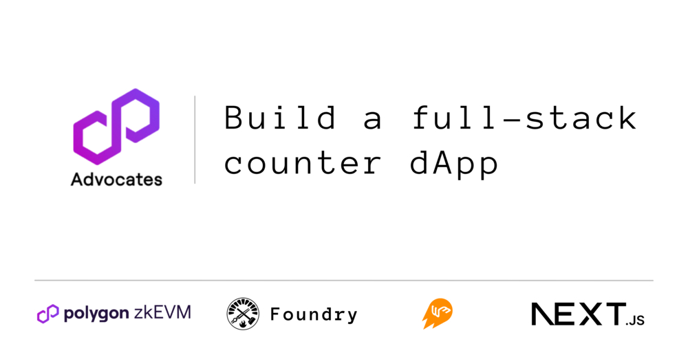

# 📱 Counter DApp
  

🍀 This project is a simple decentralized counter application (DApp) that demonstrates how to build a full-stack DApp using Next.js, Web3.js, Foundry, and Polygon zkEVM. Users can interact with the counter by incrementing and decrementing its value through a user-friendly interface. 🍀

## 👩🏻‍🔧 Technologies

**💻 Frontend**: 

[Next.js](https://nextjs.org/docs) - A React-based framework for server-rendered applications.

**⛓️ Blockchain Interaction**: 

[Web3.js](https://web3js.readthedocs.io/en/v1.10.0/) - A JavaScript library for interacting with Ethereum-based blockchains.

**📜 Smart Contracts**: 

[Foundry](https://book.getfoundry.sh/) - A Rust-based smart contract development framework for writing, testing, and deploying contracts.

**💜 Blockchain Network**:

[Polygon zkEVM](https://zkevm.polygon.technology/) - A Layer 2 Ethereum-compatible scalable network, utilizing zero-knowledge rollups for efficient and secure transactions.

## 🧑‍💻 Getting Started

### 📚 Prerequisites

- Node.js (>= 14.x.x)
- Yarn (>= 1.22.x)
- Foundry CLI

### ⬇️ Installation

1. 🛠️ Clone the repository:

   ```
   git clone https://github.com/Polygon-Advocates/zkevm-nextjs-counter-dapp.git && cd zkevm-nextjs-counter-dapp
   ```
   

2. 🛠️ Install the frontend dependencies:

   ```
   cd frontend && yarn install
   ```


3. 🛠️ Compile and deploy the smart contract:

   ```
   cd ../contracts && foundry build && foundry deploy
   ```

   Make sure to copy the deployed contract address for the next step.
   

4. 🛠️ Configure the frontend:

   Create a `.env.local` file in the `frontend` directory with the following content:

   ```
   NEXT_PUBLIC_CONTRACT_ADDRESS=YOUR_DEPLOYED_CONTRACT_ADDRESS
   
   NEXT_PUBLIC_RPC_URL=YOUR_RPC_URL
   ```

   Replace `YOUR_DEPLOYED_CONTRACT_ADDRESS` with the contract address from the previous step, and `YOUR_RPC_URL` with a valid RPC URL for the Polygon zkEVM network.
   

5. 🛠️ Run the frontend development server:

   ```
   cd ../frontend && yarn dev
   ```

   The application should now be accessible at [http://localhost:3000](http://localhost:3000).

## 👩🏻‍🔧 Contributing

Please read [CONTRIBUTING.md](CONTRIBUTING.md) for details on our code of conduct, and the process for submitting pull requests to the project.

## 🪪 License

This project is licensed under the MIT License - see the [LICENSE.md](LICENSE.md) file for details.
